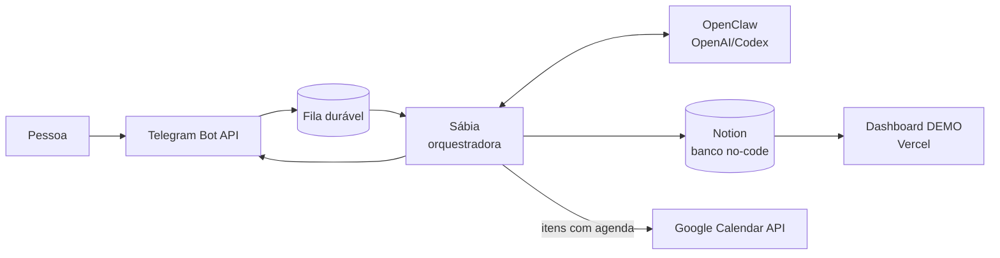
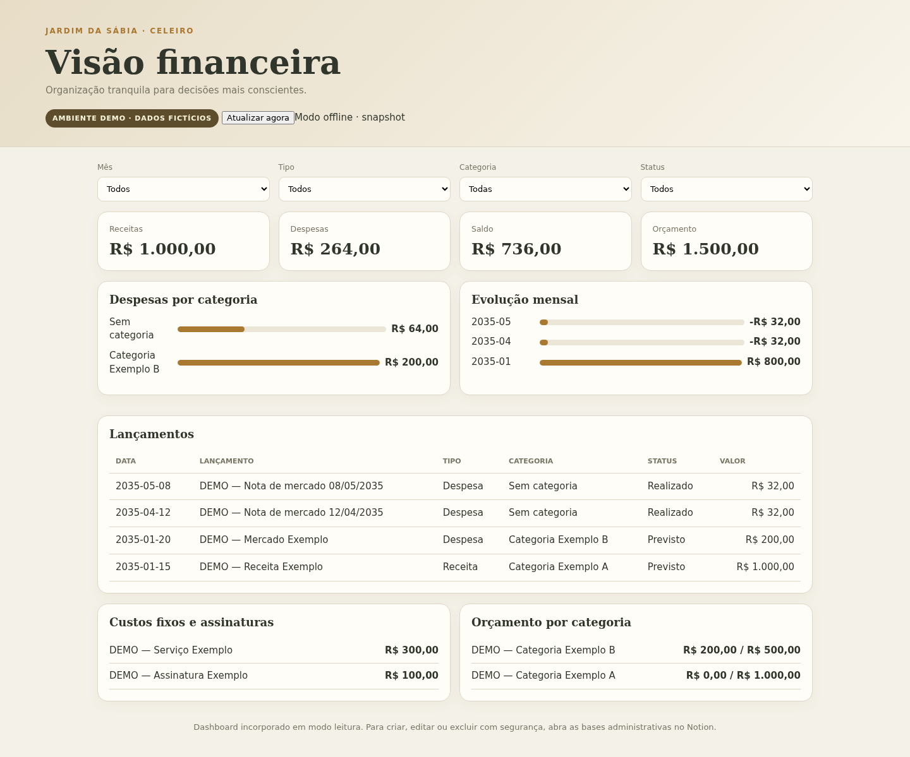
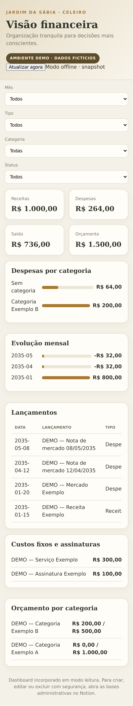
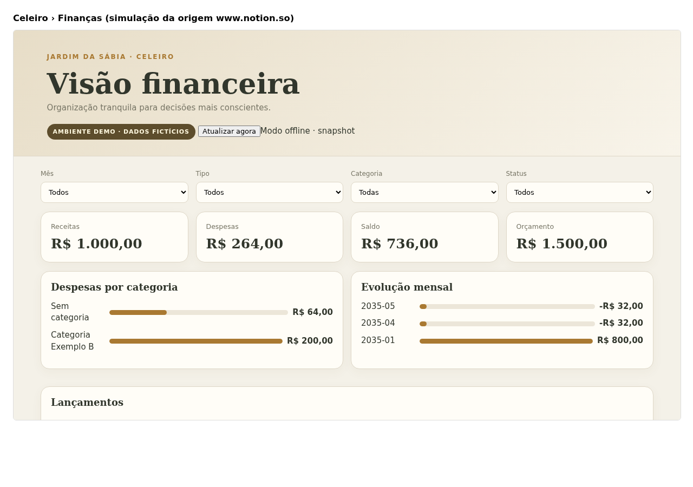

# Sábia

**Inteligência para cultivar a vida.**
Projeto acadêmico desenvolvido por **Bruna Rezer**.

A Sábia é uma central inteligente de organização pessoal. A pessoa envia uma
mensagem em linguagem natural pelo Telegram; a aplicação classifica o pedido,
registra a informação em bases no-code do Notion e, quando há um compromisso
com data, cria o evento na Google Agenda. Um dashboard web reúne informações
financeiras de demonstração em uma interface responsiva.

> Exemplo: “Reunião com o cliente na quinta às 14h” → compromisso no Notion →
> evento na Google Agenda → confirmação no Telegram.

[Abrir o dashboard DEMO](https://sabia-dashboard-demo.vercel.app) ·
[Ver o fluxo detalhado](docs/fluxo.md) ·
[Ver a documentação de arquitetura](docs/arquitetura.md) ·
[Repositório no GitHub](https://github.com/brunarezerdev/sabia-organizacao-pessoal)

## Problema e solução

Informações pessoais chegam em momentos e formatos diferentes e acabam
espalhadas entre conversas, agenda, listas e anotações. Além do retrabalho, a
necessidade de decidir onde guardar cada item aumenta a chance de esquecimento
e erro.

A Sábia reduz essa fricção com um único ponto de entrada. A central:

1. recebe e autoriza a mensagem pelo Telegram;
2. preserva a tarefa em uma fila local durável;
3. usa a rota ativa **OpenClaw com provider OpenAI/Codex** para compreender e
   encaminhar o pedido;
4. grava o item estruturado no Notion;
5. cria um evento na Google Agenda quando a classificação exige agenda;
6. devolve uma confirmação objetiva para a pessoa.

O projeto atende ao enunciado ao integrar mais de duas APIs, autenticar cada
serviço, tratar os dados, persistir em banco no-code, automatizar o fluxo e
oferecer uma interface de consulta.

## Funcionalidades entregues

- captura por Telegram com lista de usuários autorizados;
- classificação de mensagens em linguagem natural por agentes especializados;
- validação de campos e pergunta de confirmação quando falta dado essencial;
- persistência estruturada em databases do Notion;
- criação e consulta de eventos na Google Agenda;
- fila durável com retentativa e recuperação de tarefas interrompidas;
- briefing diário e ritual semanal com regras “se-então”;
- processamento idempotente de nota fiscal **DEMO**, sem guardar OCR bruto ou
  identificadores fiscais;
- dashboard financeiro público, responsivo e somente leitura;
- modo local demonstrável, sem credenciais e sem chamadas de rede;
- testes automatizados e varredura de dados sensíveis.

## APIs utilizadas e justificativa

| Serviço | Papel | Autenticação | Justificativa |
|---|---|---|---|
| **Telegram Bot API** | canal de entrada e resposta | token do bot e allowlist de usuário/chat | aproveita um aplicativo já presente no cotidiano e reduz a fricção de captura |
| **Google Calendar API v3** | consulta e criação de eventos | OAuth 2.0 ou conta de serviço | registra o compromisso na agenda que a pessoa já acompanha |
| **Notion API** | banco no-code e gestão visual | Bearer token com páginas compartilhadas explicitamente | permite consultar, filtrar e corrigir dados sem SQL |
| **OpenAI/Codex via OpenClaw** | compreensão, classificação e orquestração | OAuth por device-code | mantém a rota inteligente centralizada e separada das credenciais das demais APIs |

As duas APIs centrais exigidas pelo trabalho são **Telegram** e **Google
Agenda**. O **Notion** cumpre a persistência no-code e também funciona como
superfície administrativa. A rota inteligente ativa é OpenClaw com provider
OpenAI/Codex; o classificador heurístico local existe para demonstração e
degradação segura quando a IA não está disponível.

## Arquitetura e fluxo



A captura e o processamento são independentes: a mensagem entra na fila antes
de qualquer chamada externa. Se uma integração falhar, o sistema preserva o
item e informa a falha em vez de perder silenciosamente o registro. O fluxo
completo, os estados da fila e os mecanismos de autenticação estão em
[`docs/fluxo.md`](docs/fluxo.md).

### Nota fiscal DEMO

O fluxo controlado de nota recebe um arquivo sintético, extrai apenas os campos
necessários, cria um lançamento financeiro e atualiza a despensa/lista de
compras no Notion. Um fingerprint evita duplicidade no reenvio. O modo exige
`SABIA_DEMO=1` e fontes DEMO explícitas; CPF, CNPJ, cartão, endereço, chave
fiscal, texto OCR bruto e o arquivo recebido não são persistidos. Veja o
[roteiro de demonstração](docs/demo-nota-pitch.md) e a
[evidência sanitizada](docs/evidencias/nota-demo-20260830.md).

### Dashboard

O dashboard público consulta somente bases DEMO do Notion por uma integração
de leitura e mantém um snapshot fictício como fallback. A API pública aceita
apenas `GET`, filtra registros que não estejam marcados como demonstração e não
devolve IDs de páginas, cursores ou erros internos.

**Acesso:** <https://sabia-dashboard-demo.vercel.app>

O Notion administrativo não é publicado neste README porque contém a camada de
gestão da instalação. O bot também depende da allowlist configurada e não é
apresentado como demonstração pública irrestrita.

## Evidências visuais

As imagens abaixo foram produzidas no ambiente publicado e usam somente dados
fictícios, identificados como DEMO.

### Dashboard em desktop



### Dashboard em dispositivo móvel



### Incorporação permitida no Notion



> A terceira imagem valida a política de incorporação na origem do Notion; não
> é uma captura da conta pessoal da autora.

## Tecnologias e ferramentas

- Python 3.10+, `requests`, pytest e biblioteca padrão;
- Telegram Bot API, Notion API e Google Calendar API v3;
- OpenClaw com provider OpenAI/Codex;
- MCP para ferramentas de agenda e nota DEMO;
- HTML, CSS e JavaScript sem framework no dashboard;
- Vercel para hospedagem estática e função serverless;
- Mermaid para diagramas e systemd/cron para rotinas operacionais.

## Executar localmente

### Pré-requisitos

- Python 3.10 ou superior;
- Git;
- credenciais próprias apenas para usar as integrações reais;
- Node.js/OpenClaw somente para executar a rota inteligente completa.

### Instalação

```bash
git clone https://github.com/brunarezerdev/sabia-organizacao-pessoal.git
cd sabia-organizacao-pessoal
python3 -m venv .venv
source .venv/bin/activate
python3 -m pip install -r requirements.txt
```

### Demonstração offline

```bash
python3 -m sop diagnostico
python3 -m sop demo
python3 -m sop simular
```

Esses comandos usam dados fictícios e o classificador heurístico local. Não
chamam APIs nem gravam dados reais.

### Configuração das integrações

```bash
cp .env.example .env
```

Preencha apenas o necessário. O [`.env.example`](.env.example) documenta todas
as opções sem valores secretos. As principais variáveis são:

| Integração | Variáveis |
|---|---|
| Telegram | `TELEGRAM_BOT_TOKEN` ou `TELEGRAM_BOT_TOKEN_PATH`, `TELEGRAM_CHAT_ID_AUTORIZADO` |
| Notion | `NOTION_TOKEN` ou `NOTION_TOKEN_PATH`, `NOTION_DATABASE_ID` e IDs das bases usadas |
| Google Agenda | `GOOGLE_CALENDAR_ID` e `GOOGLE_TOKEN_PATH` ou `GOOGLE_SERVICE_ACCOUNT_PATH` |
| OpenClaw/Codex | `IA_BACKEND`, `OPENCLAW_BASE`, `OPENCLAW_AGENTE`, `OPENCLAW_MODELO`, `OPENCLAW_COMANDO` |
| Geral | `TIMEZONE`, `FILA_DIR` |
| Ambiente DEMO | `SABIA_DEMO` e IDs das fontes DEMO correspondentes |

Nunca versione o `.env`, tokens OAuth, chaves, arquivos de sessão ou backups.
Para o preparo das bases e autorizações, consulte
[`docs/openclaw.md`](docs/openclaw.md),
[`docs/google-agenda.md`](docs/google-agenda.md) e
[`docs/deploy-vercel-demo.md`](docs/deploy-vercel-demo.md).

### Execução integrada

```bash
python3 scripts/verificar_config.py
python3 -m sop escutar --processar
```

Em produção, captura e processamento podem ser separados:

```bash
python3 -m sop escutar  # terminal 1
python3 -m sop worker   # terminal 2
```

## Testes e evidências

Execução fresca em **1º de setembro de 2026**:

```bash
python3 -m pytest
# 301 passed

bash scripts/varredura_seguranca.sh
# varredura concluída sem ocorrências
```

Os 301 testes são locais: clientes HTTP e integrações externas são substituídos
por dublês, sem rede ou credenciais reais. A suíte cobre, entre outros pontos:

- classificação, datas relativas e validação de lacunas;
- clientes Telegram, Notion e Google Agenda;
- OAuth, allowlist e não vazamento de token em erros;
- persistência, retentativa e recuperação da fila;
- automações diária e semanal;
- OpenClaw, MCP de agenda e nota DEMO;
- API e responsividade funcional do dashboard;
- padrões de segredos e dados pessoais no conteúdo versionado.

Evidências de execuções reais e controladas ficam em
[`docs/evidencias/`](docs/evidencias/). Elas registram o que foi provado sem
publicar credenciais ou conteúdo pessoal.

## Segurança, LGPD e governança

- credenciais entram por ambiente ou por arquivos externos com permissão
  restrita; nenhuma credencial deve ser versionada;
- Telegram aceita somente IDs autorizados e descarta silenciosamente origens
  desconhecidas;
- Google usa escopo de calendário e tokens renováveis; Notion enxerga somente
  páginas compartilhadas com a integração;
- o dashboard é somente leitura, filtra dados DEMO e aplica CSP, HSTS,
  `nosniff`, política de referência e restrições de permissões;
- erros públicos são genéricos e não revelam tokens, IDs internos ou respostas
  cruas de provedores;
- a nota DEMO aplica minimização, finalidade, idempotência e descarte de dados
  desnecessários;
- a pessoa continua podendo revisar e corrigir os registros no Notion;
- a varredura automatizada bloqueia padrões de token, chave privada e dados
  pessoais antes da entrega.

Mais detalhes no [modelo de segurança](docs/seguranca.md).

## Estrutura do repositório

```text
.
├── agentes/             definições dos agentes de domínio
├── api/                 endpoint serverless do dashboard
├── dashboard/           interface web e snapshot DEMO
├── docs/                arquitetura, fluxo, segurança e evidências
├── exemplos/            mensagens, regras e semana fictícias
├── openclaw/            configuração gerada dos agentes
├── sabia/               runtime e fila da instalação Sábia
├── scripts/             configuração, automações, deploy e scans
├── src/sop/             aplicação Python e integrações
├── systemd/             unidades de serviço
└── tests/               suíte automatizada
```

## Limitações conhecidas

- a execução completa requer contas e credenciais próprias para Telegram,
  Notion, Google e OpenClaw/Codex;
- o bot não é aberto ao público: a allowlist é uma decisão de segurança;
- o dashboard público expõe apenas dados DEMO e é uma interface de consulta,
  não de edição;
- o snapshot local pode ser exibido se a leitura DEMO do Notion estiver
  temporariamente indisponível;
- parte dos agentes especializados roda pelo runtime Python, e somente os
  agentes marcados como ativos possuem workspace no OpenClaw;
- o parsing de PDF escaneado depende de conversão/OCR disponível no ambiente;
- não há link de vídeo pitch ou slides versionado neste repositório.

## Próximos passos

- habilitar deploy automático do dashboard a partir da branch principal;
- ampliar os testes de execução do briefing com um ambiente controlado;
- adicionar conversão local de páginas de PDF escaneado antes do OCR;
- criar observabilidade agregada sem registrar o conteúdo das mensagens;
- publicar o vídeo pitch e acrescentar aqui somente um link revisado e
  acessível.

## Documentação relacionada

- [Fluxo de integração e diagramas](docs/fluxo.md)
- [Decisões de arquitetura](docs/arquitetura.md)
- [OpenClaw e rota OpenAI/Codex](docs/openclaw.md)
- [Google Agenda](docs/google-agenda.md)
- [Segurança](docs/seguranca.md)
- [Deploy do dashboard DEMO](docs/deploy-vercel-demo.md)
- [Demonstração da nota](docs/demo-nota-pitch.md)
- [Evidências técnicas](docs/evidencias/)

## Licença

MIT.
