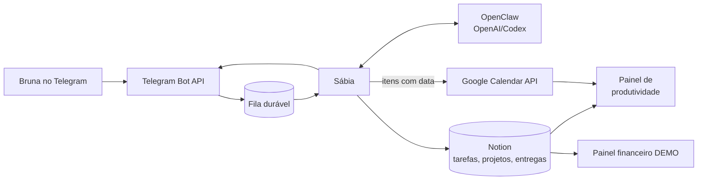
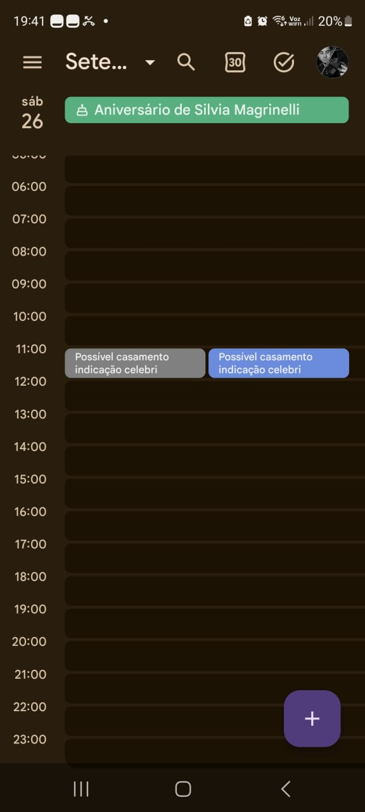
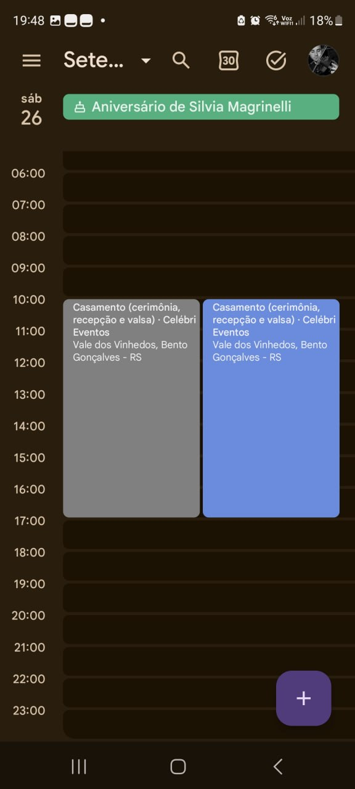
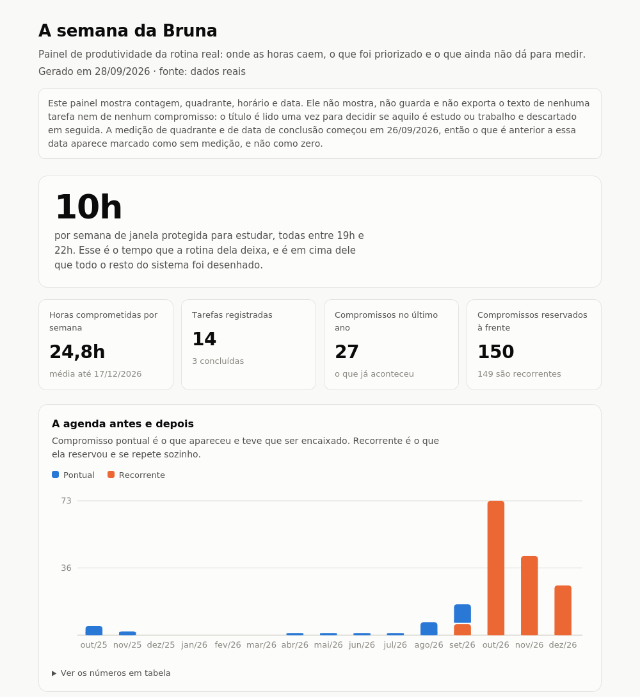
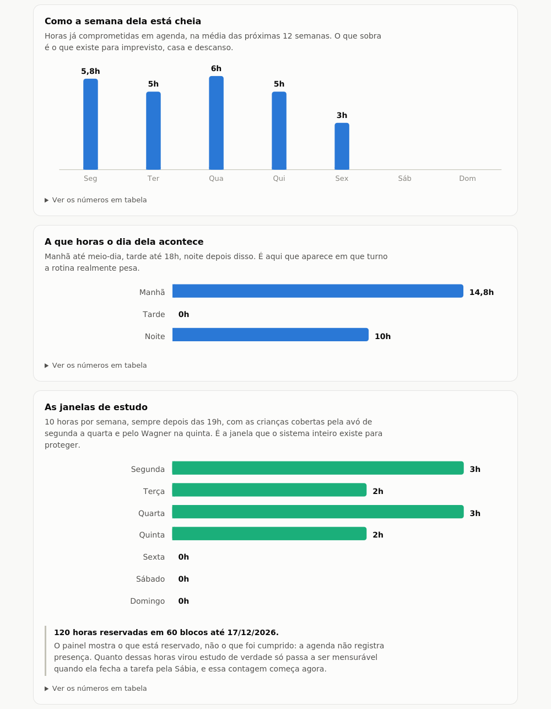
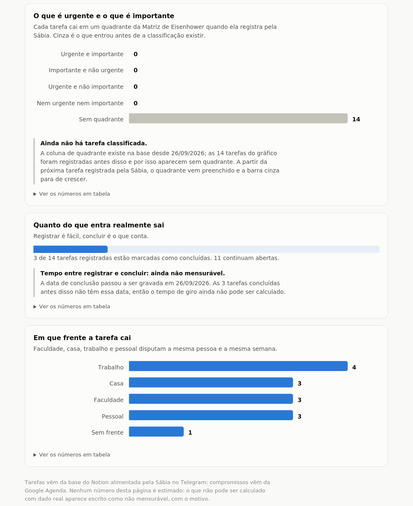
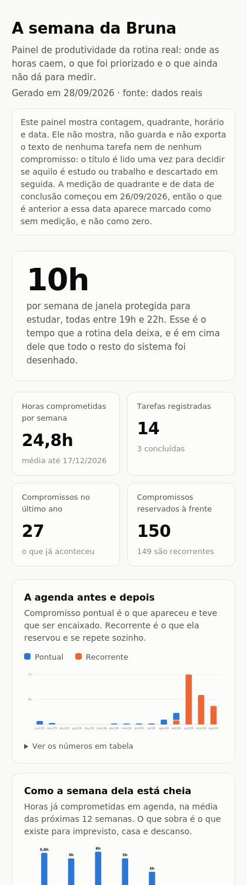
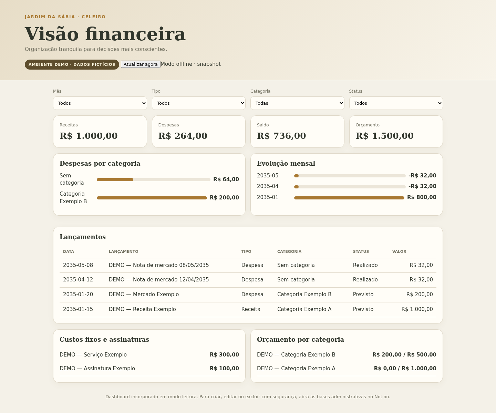

# Meu Sistema Operacional Pessoal

Trabalho de Produtividade e Gestão do Tempo · **Bruna Rezer**

Eu tenho quatro frentes rodando ao mesmo tempo: três filhos pequenos, a casa, a
graduação em IA e Automação Digital e a operação da Música e-Gig, onde sou COO.
O meu desafio é ter tempo hábil para dar conta de todas as obrigações sem
atrasos. Este repositório é o sistema que eu montei para isso.

O sistema tem três camadas: a **Sábia**, assistente que eu uso pelo Telegram, o
**Notion**, onde tudo fica organizado, e a **Google Agenda**, onde o tempo é
reservado. Em cima disso roda um **painel de produtividade** que me diz se
aquilo está funcionando.

[Repositório no GitHub](https://github.com/brunarezerdev/sabia-organizacao-pessoal) ·
[Fluxo detalhado](docs/fluxo.md) ·
[Arquitetura](docs/arquitetura.md)

---

## Onde está cada requisito do enunciado

| Requisito | Onde está neste README |
|---|---|
| Organização de tarefas e prioridades | [5. Tarefas e prioridades](#5-tarefas-e-prioridades) |
| Planejamento semanal ou mensal | [6. Planejamento semanal e mensal](#6-planejamento-semanal-e-mensal) |
| Gestão de compromissos | [7. Gestão de compromissos](#7-gestão-de-compromissos) |
| Pelo menos uma técnica de produtividade | [8. A técnica aplicada: Matriz de Eisenhower](#8-a-técnica-aplicada-matriz-de-eisenhower) |
| Pelo menos uma ferramenta digital | [3. Ferramentas utilizadas](#3-ferramentas-utilizadas) (Notion) |
| IA para automatizar, resumir, organizar ou planejar | [9. Como a IA entra](#9-como-a-ia-entra) |
| Dashboard ou painel de acompanhamento | [10. O painel de produtividade](#10-o-painel-de-produtividade) |
| README: descrição do sistema | [1. O sistema](#1-o-sistema) |
| README: ferramentas utilizadas | [3. Ferramentas utilizadas](#3-ferramentas-utilizadas) |
| README: fluxo de organização | [4. O fluxo de organização](#4-o-fluxo-de-organização) |
| README: prints | [7](#7-gestão-de-compromissos), [10](#10-o-painel-de-produtividade) e [11](#11-o-painel-financeiro-demo) |
| README: como utilizar a solução | [12. Como utilizar a solução](#12-como-utilizar-a-solução) |

---

## 1. O sistema

A ideia é simples: eu tenho um lugar só para falar, e o resto se organiza
sozinho atrás disso.

Eu mando uma frase para a Sábia pelo Telegram, por texto ou por áudio. Ela
entende o que é aquilo, classifica a prioridade, grava na base certa do Notion
e, se tiver data e hora, cria o compromisso na Google Agenda. Depois eu abro o
painel e vejo onde as minhas horas foram parar.

Escolhi esse desenho porque eu sou interrompida o tempo todo. Qualquer sistema
que exija abrir um aplicativo, achar a tela certa e preencher formulário não
cabe no tempo que eu tenho quando a demanda aparece. Mandar uma mensagem cabe.

## 2. A rotina que o sistema precisa atender

Minha semana tem horários fixos, e eles estão todos bloqueados na agenda:

| Quando | O quê | Horas por semana |
|---|---|---|
| Segunda a sexta, 9h às 12h | e-Gig, bloco de trabalho | 15h |
| Segunda, 19h às 20h | Estudo | 1h |
| Segunda, 20h às 22h | Comunidade Avalanche | 2h |
| Terça, 19h às 21h | Aula ao vivo da UniFECAF | 2h |
| Quarta, 19h às 22h | Estudo | 3h |
| Quinta, 19h às 21h | Aula ao vivo da UniFECAF | 2h |

São 25 horas reservadas por semana: 15 de manhã e 10 à noite. A tarde fica
livre de propósito, porque é o turno em que as crianças estão em casa.

Os horários de bloqueio de estudo e de trabalho são sagrados. Nessas horas é
como se eu não estivesse em casa, eu fico inacessível. Isso só funciona porque
quem fica com as crianças já está combinado antes: minha mãe de segunda a
quarta, o Wagner na quinta.

Os blocos são eventos recorrentes até 19/12/2026, então eu não preciso lembrar
de recriar nada toda semana. Setembro inteiro também está preenchido com os
mesmos blocos, para o painel ter base de comparação.

## 3. Ferramentas utilizadas

| Ferramenta | Para que serve aqui | Por que essa |
|---|---|---|
| **Telegram** | onde eu falo com o sistema | já está aberto no meu celular na hora em que a demanda aparece |
| **Notion** | onde tarefas, projetos, entregas e refeições moram | eu consigo abrir, filtrar e corrigir sem depender do sistema e sem escrever SQL |
| **Google Agenda** | onde os compromissos e as janelas protegidas ficam | é a agenda que eu já uso e que dá para compartilhar com a família |
| **OpenAI/Codex via OpenClaw** | a compreensão da frase e a classificação de prioridade | mantém a rota de IA separada das credenciais das outras integrações |
| **Python e pytest** | a cola entre tudo e a garantia de que não quebrou | |
| **Vercel** | hospedagem do painel financeiro DEMO | |

Autenticação de cada integração:

| Serviço | Autenticação | Uso |
|---|---|---|
| Telegram Bot API | token do bot e allowlist de usuário e chat | entrada e resposta |
| Google Calendar API v3 | OAuth 2.0 ou conta de serviço | consulta e criação de eventos |
| Notion API | Bearer token, páginas compartilhadas explicitamente | banco no-code |
| OpenAI/Codex via OpenClaw | OAuth por device-code | classificação e orquestração |

O projeto não guarda chave de provedor de IA.

## 4. O fluxo de organização


```mermaid
flowchart LR
    B[Bruna no Telegram] --> TG[Telegram Bot API]
    TG --> F[(Fila durável)]
    F --> S[Sábia]
    S <--> IA[OpenClaw<br/>OpenAI/Codex]
    S --> N[(Notion<br/>tarefas, projetos, entregas)]
    S -->|itens com data| G[Google Calendar API]
    S --> TG
    N --> P[Painel de<br/>produtividade]
    G --> P
    N --> D[Painel financeiro DEMO]
```

Num dia comum isso acontece assim:

1. **Capturo na hora.** No meio do jantar ou no corredor da escola eu escrevo
   para a Sábia: *"lembrar de pagar o boleto da escola até sexta"*.
2. **Ela classifica e grava.** Decide o quadrante de Eisenhower, grava a linha
   na base de tarefas do Notion com a data de registro e responde dizendo em
   que quadrante ficou.
3. **Se tem data, vira compromisso.** O mesmo fluxo cria o evento na agenda,
   conferindo antes se o horário já está ocupado. Nada é sobreposto por conta
   própria.
4. **De manhã, o briefing.** Um resumo do que está aberto e do que vence, para
   eu não abrir quatro aplicativos antes das 7h.
5. **No domingo, o ritual semanal.** Fecha a semana que terminou e abre a que
   começa.
6. **Quando concluo, eu aviso.** *"concluí a tarefa do boleto"* marca a linha
   como feita e grava a data real de conclusão.
7. **O painel mostra o resultado.** Onde as horas caíram, o que foi priorizado
   e quanto do que entra realmente sai.

Se a Sábia classificar errado, eu corrijo falando: *"muda a tarefa do boleto
para importante e não urgente"*. Quando a frase não dá para decidir um dos
eixos, ela usa a opção conservadora e diz qual suposição fez.

A captura é independente da execução. A tarefa entra na fila no segundo em que
eu penso nela, mesmo num dia em que eu não tenho nenhum minuto livre. Isso
importa porque a minha rede de apoio é combinada, não contratada: filho doente
ou imprevisto da minha mãe derruba a noite inteira, e o sistema precisa
continuar guardando o que eu não consegui fazer.

## 5. Tarefas e prioridades

O Notion está dividido em nove territórios: Início, Família e Lar, Projetos,
Alimentação, Rotina Pessoal, Conhecimento, Finanças e Recursos, Documentos e
Planejamento e Produtividade.

A base de tarefas é a lista **Prazos e tarefas**, dentro de Planejamento e
Produtividade. Cada linha tem prazo, onde (Faculdade, Trabalho, Casa, Pessoal),
prioridade pela Matriz de Eisenhower, data de registro e data de conclusão.

Outras duas bases entraram junto, porque elas disputam o mesmo tempo:

- **Entregas**, base única ligada às disciplinas em Conhecimento. Toda entrega
  da faculdade vive ali, com a disciplina relacionada, em vez de ficar espalhada
  por página solta.
- **Planejamento de Refeições**, em Família e Lar, ligado ao cardápio da
  semana. Decidir o que vai ter para comer é parte do trabalho invisível que
  consome o meu tempo, então ele entra no sistema como qualquer outra coisa.

## 6. Planejamento semanal e mensal

São três camadas, da semana para o semestre.

**A semana.** Os blocos recorrentes da seção 2 reservam o tempo antes da semana
começar. No domingo, o ritual fecha a semana que terminou e abre a seguinte:
mostra o que foi concluído, o que vence e as tarefas derivadas pelas regras
se-então que eu cadastrei no Notion.

**O mês.** A faculdade é rotativa, uma disciplina por mês, com entrega no fim
do mês. A base de Entregas mostra isso em calendário, então eu vejo o pico
chegando com semanas de antecedência.

**O semestre.** O roadmap da e-Gig está no Notion em 17 fases, da fase 0 à 16,
quebradas em **172 blocos de 3 horas**, 516 horas no total. Eu planejo **5
blocos por semana**, de 29/09/2026 a 28/03/2027. Desses 172, 130 estão
planejados e 42 são retroativos, 126 horas de trabalho que já aconteceram e que
eu registrei para o roadmap partir do estado real.

As fases 6 a 16 têm quadrante de Eisenhower: duas em Q1, urgente e importante, e
nove em Q2, importante e não urgente. As fases 0 a 5 não têm, porque já estão
concluídas. O status usa quatro cores, e o que está concluído não carrega
prioridade.

O roadmap tem visão de timeline, tabela por fase, agrupamento por quadrante,
calendário por semana e uma lista de próximos blocos filtrada pelo que ainda
não terminou.

## 7. Gestão de compromissos

Compromisso é diferente de tarefa. Tarefa é uma coisa que eu faço quando dá;
compromisso é uma hora em que eu não estou disponível para mais nada. O que o
sistema precisa acertar é a **duração real**, não só a hora de começar.

Quando eu salvo um compromisso pela Sábia, ela guarda também quanto tempo eu
fico presa nele. Com isso eu sei quanto me sobra de verdade. Quando a anotação
é feita às pressas, acontece o contrário: eu fico com uma noção errada do tempo
livre e conto com horas que não existem.

### O caso do sábado 26/09/2026

Um cachê do Wagner foi anotado de forma vaga, das 11h às 12h, sem local. Na
verdade era um casamento no Vale dos Vinhedos, em Bento Gonçalves, com
cerimônia, recepção e valsa. Ele saiu de casa de manhã e só se liberou às
15h30, chegando às 17h.

O planejamento da família foi montado em cima daquela hora anotada, como se ele
já estivesse em casa ao meio-dia. Minha mãe estava com as crianças, tinha
compromisso à tarde e teve que desmarcar. Ele estava com o meu carro, então eu
também não pude buscar as crianças. Uma anotação errada quebrou o dia inteiro
em cadeia.

Refiz o agendamento com o bloqueio real, de porta a porta:

<table>
  <tr>
    <td width="50%"></td>
    <td width="50%"></td>
  </tr>
  <tr>
    <td><b>Antes:</b> das 11h às 12h, título vago, sem local.</td>
    <td><b>Depois:</b> das 10h às 17h, com contratante, local e as etapas do evento.</td>
  </tr>
</table>

Os dois prints são da minha agenda real do dia 26/09/2026.

## 8. A técnica aplicada: Matriz de Eisenhower

A técnica escolhida é a Matriz de Eisenhower, aplicada em dois lugares: nas
tarefas da lista Prazos e tarefas e nas fases do roadmap da e-Gig.

Eu não uso a matriz na forma clássica. O método clássico supõe que quem
prioriza tem controle sobre a própria agenda e autoridade para delegar, e isso
não vale quando a prioridade chega pronta de outra pessoa. Filho doente e
chamado da escola furam qualquer fila. Por isso a matriz aqui classifica só o
que é decisão negociável: trabalho, projetos, entregas. O imprevisto de filho
fica de fora, porque ali eu não decido nada, eu reajo.

Duas práticas acompanham a matriz:

- **Anotar o próximo micro-passo antes de ser interrompida.** Retomar uma
  tarefa do zero custa caro, e eu sou interrompida o tempo todo. Em vez de
  defender um bloco contínuo que quase nunca sobrevive, eu barateio a volta.
- **Capturar a carga mental, e não só a tarefa.** O que me cansa é lembrar, não
  executar. Então o que precisa ser lembrado entra como item igual ao que
  precisa ser feito.

O raciocínio completo, com as fontes e com o que não tem comprovação
científica, está na parte teórica que acompanha esta entrega.

## 9. Como a IA entra

A IA aqui faz uma coisa só: transformar uma frase solta, escrita com pressa, em
um registro estruturado no lugar certo.

- **Linguagem natural.** Não existe formulário, campo obrigatório nem menu. Eu
  escrevo ou falo como falo, e o modelo extrai título, data, hora e categoria.
- **Priorização.** O modelo decide o quadrante de Eisenhower a partir do texto
  e explica a suposição quando a frase é ambígua.
- **Datas relativas.** "quinta que vem", "depois de amanhã" e "até sexta" viram
  data de calendário.
- **Leitura de documento por foto.** Em 26/09/2026 eu mandei a foto de uma
  notinha de supermercado. O sistema reconheceu dois itens e R$ 39,47, pediu
  confirmação de um trecho que estava apagado, registrou no ambiente DEMO e, no
  reenvio da mesma foto, não duplicou nada.
- **Degradação segura.** Quando a rota de IA não está disponível, um
  classificador local por palavra-chave assume. O sistema perde precisão e
  continua de pé, mas nunca deixa de guardar o que eu mandei.

A rota ativa é OpenClaw com provider OpenAI/Codex, autenticada por OAuth.

## 10. O painel de produtividade

O painel responde à pergunta que o resto do sistema não responde: isso está
funcionando? Ele é gerado por um comando, sai como um HTML de arquivo único que
abre offline, e lê duas fontes reais, a base de tarefas no Notion e a Google
Agenda.

```bash
python3 -m sop painel              # com os meus dados
python3 -m sop painel --exemplo    # com dados fictícios, sem credencial nenhuma
```

### O que ele mostra

- **A agenda antes e depois.** Compromissos por mês nos últimos doze meses,
  separados entre pontuais e recorrentes.
- **Como a semana está cheia.** Horas comprometidas por dia da semana.
- **A que horas o dia acontece.** Manhã, tarde e noite.
- **As janelas de estudo.** Quantas horas estão reservadas, em que dias, até
  quando.
- **O que é urgente e o que é importante.** Distribuição pelos quatro
  quadrantes.
- **Quanto do que entra realmente sai.** Concluídas contra registradas, e a
  mediana de dias entre registrar e concluir.
- **Em que frente a tarefa cai.** Faculdade, casa, trabalho e pessoal.

### Prints

Capturas do painel gerado com dados reais em 28/09/2026. Nenhuma delas contém
texto de tarefa ou de compromisso.

**Visão geral, indicadores e a mudança na agenda**



**Carga por dia da semana, por turno e janelas de estudo**



**Prioridades, conclusão e o que ainda não é mensurável**



**No celular**



### O que ele ainda não mede, e por quê

O painel não preenche buraco com estimativa. O quadrante e a data de conclusão
começaram a ser gravados em 26/09/2026, e o que é anterior a essa data não tem
esses campos porque o dado não existia. Onde falta medição, o painel escreve a
razão no lugar do número. Hoje isso dá duas consequências:

- as 14 tarefas anteriores aparecem como "sem quadrante", e não como zero
  distribuído entre os quadrantes;
- o tempo entre registrar e concluir ainda não é calculável, porque as tarefas
  concluídas antes de 26/09 não têm data de conclusão.

O painel também mostra horas de estudo reservadas, não cumpridas. A agenda não
registra presença.

### Privacidade e acessibilidade

O conteúdo das minhas tarefas é real e inclui saúde das minhas crianças. Por
isso o painel foi construído para ser incapaz de vazar texto, e não apenas
configurado para não vazar:

- os conversores de fronteira devolvem registros sem nenhum campo de texto.
  Depois da fronteira, o conteúdo não existe mais na memória do processo;
- o título de um compromisso é lido uma vez só, por uma função só, para decidir
  se aquilo é estudo ou trabalho, e é descartado na mesma expressão;
- a classificação é conservadora: só entra em "Estudo" ou "Trabalho" o que casa
  com um termo explícito. Consulta médica e escola caem em "Outros";
- um teste automatizado alimenta o painel com títulos sensíveis e falha se
  qualquer pedaço deles aparecer no HTML;
- o HTML fica fora do versionamento. O que entra no repositório são os prints
  acima, que por construção só contêm contagem, quadrante, horário e data.

Cada gráfico traz uma tabela equivalente dobrável, para quem não distingue as
cores e para leitor de tela. A paleta foi verificada contra visão de cores e
contraste no modo claro e no escuro, e o painel segue o tema do sistema
operacional.

## 11. O painel financeiro DEMO

Existe também um painel financeiro publicado na web, em modo estritamente de
demonstração. Ele nasceu da leitura de nota fiscal por foto descrita na seção 9.

**Acesso:** <https://sabia-dashboard-demo.vercel.app>

Ele consulta apenas bases marcadas como DEMO, descarta toda linha que não esteja
marcada assim, aceita somente `GET` e não devolve identificador interno. A
gravação no meu financeiro real não está autorizada e não está ligada.



## 12. Como utilizar a solução

### Pré-requisitos

- Python 3.10 ou superior e Git;
- credenciais próprias, apenas se você quiser ligar as integrações reais;
- Node.js e OpenClaw somente para a rota de IA completa.

### Instalação

```bash
git clone https://github.com/brunarezerdev/sabia-organizacao-pessoal.git
cd sabia-organizacao-pessoal
python3 -m venv .venv
source .venv/bin/activate
python3 -m pip install -r requirements.txt
```

### Ver funcionando sem nenhuma credencial

```bash
python3 -m sop diagnostico        # o que está configurado e o que falta
python3 -m sop demo               # classifica mensagens de exemplo
python3 -m sop simular            # ritual de domingo de ponta a ponta
python3 -m sop painel --exemplo   # gera o painel com dados fictícios
```

Esses comandos não chamam API nenhuma, não gravam nada e não usam dado real.
O painel sai em `painel/painel.html`, basta abrir no navegador.

### Ligar as integrações

```bash
cp .env.example .env
python3 scripts/verificar_config.py
```

Preencha só o necessário. O [`.env.example`](.env.example) documenta todas as
opções sem valor secreto.

| Integração | Variáveis |
|---|---|
| Telegram | `TELEGRAM_BOT_TOKEN` ou `TELEGRAM_BOT_TOKEN_PATH`, `TELEGRAM_CHAT_ID_AUTORIZADO` |
| Notion | `NOTION_TOKEN` ou `NOTION_TOKEN_PATH`, `NOTION_DATABASE_ID`, `NOTION_TAREFAS_DATABASE_ID` |
| Google Agenda | `GOOGLE_CALENDAR_ID` e `GOOGLE_TOKEN_PATH` ou `GOOGLE_SERVICE_ACCOUNT_PATH` |
| OpenClaw/Codex | `IA_BACKEND`, `OPENCLAW_BASE`, `OPENCLAW_AGENTE`, `OPENCLAW_MODELO`, `OPENCLAW_COMANDO` |
| Geral | `TIMEZONE`, `FILA_DIR` |
| Ambiente DEMO | `SABIA_DEMO` e os IDs das fontes DEMO |

Nunca versione o `.env`, token OAuth, chave, arquivo de sessão ou backup.
O preparo das bases está em [`docs/openclaw.md`](docs/openclaw.md),
[`docs/google-agenda.md`](docs/google-agenda.md) e
[`docs/deploy-vercel-demo.md`](docs/deploy-vercel-demo.md).

### Rodar de verdade

```bash
python3 scripts/preparar_tarefas_notion.py --tarefas <id-da-base>
python3 -m sop escutar --processar     # captura e processa no mesmo laço
python3 -m sop painel                  # gera o painel com os dados reais
```

Em produção, captura e processamento ficam separados:

```bash
python3 -m sop escutar   # terminal 1
python3 -m sop worker    # terminal 2
```

## 13. Testes e segurança

Execução em 28/09/2026:

```bash
python3 -m pytest
# 365 passed

bash scripts/varredura_seguranca.sh
# RESULTADO: limpo. Nenhum padrão sensível encontrado.
```

Os testes são locais: cliente HTTP e integração externa são substituídos por
dublês, sem rede e sem credencial real. A suíte cobre classificação, datas
relativas, os clientes de Telegram, Notion e Google, OAuth e allowlist,
persistência e retentativa da fila, as automações diária e semanal, a leitura de
nota DEMO, a API do painel financeiro e o painel de produtividade, incluindo o
descarte de texto na fronteira e a garantia de que nenhum título sensível
aparece no HTML gerado.

Sobre segurança e LGPD: credencial entra por ambiente ou por arquivo externo com
permissão restrita e nunca é versionada; o Telegram aceita somente IDs
autorizados; o Google usa escopo de calendário e o Notion enxerga só as páginas
compartilhadas com a integração; o painel público é somente leitura, filtra
dados DEMO e aplica CSP, HSTS e `nosniff`; erro público é genérico e não revela
token nem ID interno; e eu continuo podendo revisar e corrigir tudo direto no
Notion. Detalhes no [modelo de segurança](docs/seguranca.md).

## 14. Estrutura do repositório

```text
.
├── agentes/             definições dos agentes de domínio
├── api/                 endpoint serverless do painel DEMO
├── dashboard/           interface web e snapshot DEMO
├── docs/                arquitetura, fluxo, segurança e evidências
├── exemplos/            mensagens, regras, semana e painel fictícios
├── openclaw/            configuração gerada dos agentes
├── sabia/               runtime e fila
├── scripts/             configuração, automações, deploy e scans
├── src/sop/             aplicação Python e integrações
├── systemd/             unidades de serviço
└── tests/               suíte automatizada
```

## 15. Limitações conhecidas

- a medição de produtividade começou em 26/09/2026, então o painel tem poucos
  dias de histórico classificado, e diz isso na própria tela;
- o painel mede horas reservadas, não horas cumpridas;
- a classificação de um compromisso entre estudo, trabalho e outros é por
  palavra-chave no título. É conservadora, mas pode errar;
- rodar o sistema completo exige contas e credenciais próprias;
- o bot não é aberto ao público, a allowlist é uma decisão de segurança;
- o painel financeiro mostra apenas dados DEMO e é somente consulta;
- o parsing de PDF escaneado depende de OCR disponível no ambiente;
- não há vídeo pitch nesta entrega.

## 16. Próximos passos

- acumular semanas de dado classificado até o tempo entre registrar e concluir
  virar um número confiável;
- registrar a conclusão dos blocos de estudo, para o painel comparar reservado
  com cumprido;
- gerar o painel automaticamente no domingo, junto com o ritual semanal;
- adicionar conversão local de PDF escaneado antes do OCR.

## Documentação relacionada

- [Fluxo de integração e diagramas](docs/fluxo.md)
- [Decisões de arquitetura](docs/arquitetura.md)
- [OpenClaw e rota OpenAI/Codex](docs/openclaw.md)
- [Google Agenda](docs/google-agenda.md)
- [Segurança](docs/seguranca.md)
- [Deploy do painel DEMO](docs/deploy-vercel-demo.md)
- [Demonstração da nota](docs/demo-nota-pitch.md)
- [Evidências técnicas](docs/evidencias/)

## Licença

MIT.
