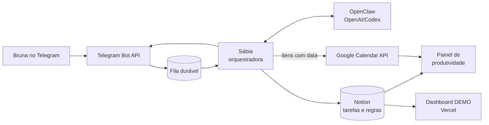

# Meu Sistema Operacional Pessoal

**A rotina de quem estuda tecnologia com três filhos em casa, e o sistema que
faz ela caber.**
Trabalho de Produtividade e Gestão do Tempo · **Bruna Rezer**

O projeto deste trabalho não é um software. É a **rotina real de uma pessoa**, e
o conjunto de métodos e ferramentas que ela usa para fazer essa rotina funcionar.
A **Sábia**, assistente que responde pelo Telegram, é a peça central desse
conjunto, mas é peça: existe para servir a uma semana que já era difícil antes
dela.

[Ver o painel de produtividade](#o-painel-de-produtividade) ·
[Ver o fluxo detalhado](docs/fluxo.md) ·
[Ver a documentação de arquitetura](docs/arquitetura.md) ·
[Repositório no GitHub](https://github.com/brunarezerdev/sabia-organizacao-pessoal)

---

## 1. O diagnóstico: que rotina é essa

Sou COO de uma operação de serviços musicais, estou no segundo semestre de uma
graduação em IA e Automação Digital, e tenho três filhos pequenos. A renda da
casa vem do trabalho do meu marido, que é violinista e maestro: ensaio,
concerto e casamento acontecem à noite e no fim de semana, muitas vezes em
outra cidade. A casa, na maior parte das noites, é comigo.

O que a agenda mostra sobre essa semana, medido e não estimado:

| O que é | Quanto |
|---|---|
| Janela protegida para estudar | **10 horas por semana**, sempre entre 19h e 22h |
| Horas já comprometidas em agenda | **24,8 horas por semana** |
| Onde essas horas caem | 14,8h de manhã, 10h à noite, **0h à tarde** |
| Quem fica com as crianças nessas janelas | minha mãe de segunda a quarta; meu marido na quinta |

**O gargalo não é falta de método nem falta de braço.** É que cada janela de
estudo tem hora para acabar, e que a rede que sustenta essas janelas é
combinada, não contratada: filho doente ou imprevisto da minha mãe derruba a
noite inteira. Some a isso o trabalho invisível de lembrar o que falta comprar,
o que a escola cobrou e quem precisa de consulta, que é o que mais cansa e é
justamente o que nenhuma lista de afazeres registra.

Por isso o sistema não aplica Pomodoro, Eisenhower ou GTD em estado puro.
Cada método aqui foi adaptado no ponto exato em que a premissa dele falha para
essa rotina, e é essa adaptação, não a adoção do método, que é o mérito do
trabalho. O raciocínio completo, com as fontes e com o que não tem sustentação
científica, está na fundamentação que acompanha a parte teórica.

## 2. Como eu uso, num dia comum

1. **A demanda chega no pior momento possível.** No meio do jantar, no
   corredor da escola, com criança no colo. Eu abro o Telegram e escrevo uma
   frase para a Sábia: *"lembrar de pagar o boleto da escola até sexta"*.
2. **A Sábia entende e arquiva.** Ela classifica a frase, decide em qual
   quadrante da Matriz de Eisenhower aquilo cai, grava a linha na base de
   tarefas do Notion com a data de registro, e devolve uma confirmação curta
   dizendo em que quadrante ficou.
3. **Se tem data, vira compromisso.** Quando a frase traz dia e hora, o mesmo
   fluxo cria o evento na Google Agenda, conferindo antes se o horário já está
   ocupado. Nada é sobreposto por conta própria.
4. **De manhã, o briefing.** Um resumo do dia com o que está aberto e o que
   vence, para eu não precisar abrir quatro aplicativos antes das 7h.
5. **No domingo, o ritual.** O sistema fecha a semana que terminou e abre a que
   começa: o que foi concluído, o que vence, e as tarefas derivadas pelas regras
   se-então que eu mesma cadastrei no Notion.
6. **Quando eu concluo, eu aviso.** *"concluí a tarefa do boleto"* marca a
   linha como feita e grava a data real de conclusão.
7. **O painel me mostra a verdade.** Gerado por um comando, ele responde onde
   as minhas horas caíram, o que foi priorizado e quanto do que entra realmente
   sai.

### A correção também é conversa

Se a Sábia classificar errado, eu corrijo falando: *"muda a tarefa do boleto
para importante e não urgente"*. Quando o texto não basta para decidir um dos
eixos, ela adota a opção conservadora e diz qual suposição fez, em vez de
escolher no escuro.

### O caminho para o dia em que a janela não existe

Nenhum plano construído sobre a disponibilidade da minha mãe pode assumir que
ela sempre estará lá. Por isso a captura é independente da execução: a tarefa
entra na fila no segundo em que eu penso nela, mesmo que eu não tenha nenhum
minuto livre naquele dia. O sistema aceita que a noite caia, e continua
guardando o que eu não consegui fazer.

## 3. As técnicas de produtividade aplicadas

| Técnica | Como está aplicada aqui | O que foi adaptado |
|---|---|---|
| **Matriz de Eisenhower** | toda tarefa registrada recebe um dos quatro quadrantes, automaticamente, e o painel mostra a distribuição | o método pressupõe controle sobre a própria agenda e poder de delegar. Aqui ele só classifica o que é decisão negociável; imprevisto de filho não entra em quadrante nenhum |
| **Registro do próximo micro-passo** | a tarefa guarda qual é o próximo passo concreto, não só o nome do projeto | a pesquisa de Gloria Mark mede em 23 minutos o custo de retomar uma tarefa interrompida. Em vez de proteger blocos longos de foco, que essa rotina não permite, o sistema barateia a retomada |
| **Captura da carga mental** | o que precisa ser lembrado entra como item, não só o que precisa ser executado | listas de afazeres medem a parte errada do trabalho. O que exaure é lembrar, e é isso que sai da cabeça e vai para a base |
| **Planejamento semanal** | ritual de domingo, que fecha uma semana e abre a outra | não é revisão de produtividade; é decidir a semana de uma vez, num horário em que dá |
| **Planejamento de período** | blocos recorrentes de estudo, aula e trabalho reservados na agenda até 17/12/2026 | a janela é reservada antes de a semana começar, senão ela é ocupada por outra coisa |

## 4. Onde a Inteligência Artificial entra

A IA aqui não escreve o trabalho nem decide a vida. Ela faz **uma coisa só, e
essa coisa é a que custa caro**: transformar uma frase solta, escrita com pressa,
em um registro estruturado no lugar certo.

- **Compreensão da linguagem natural.** Não existe formulário, campo obrigatório
  nem menu. Eu escrevo como falo e o modelo extrai título, data, hora e
  categoria.
- **Priorização.** O modelo decide o quadrante de Eisenhower a partir do texto e
  explica a suposição quando o texto é ambíguo.
- **Datas relativas.** "quinta que vem", "depois de amanhã" e "até sexta" viram
  data de calendário.
- **Roteamento por domínio.** Agentes especializados cuidam de frentes
  diferentes da vida, para que um pedido de casa não seja tratado com a mesma
  régua de um pedido da faculdade.
- **Degradação segura.** Quando a rota de IA não está disponível, um
  classificador local por palavras-chave assume. O sistema perde precisão e
  continua de pé; ele nunca deixa de guardar o que eu mandei.

A rota inteligente ativa é **OpenClaw com provider OpenAI/Codex**, autenticada
por OAuth. O projeto não guarda chave de provedor de IA.

## 5. O painel de produtividade

O painel responde à pergunta que o resto do sistema não responde: **isso está
funcionando?** Ele é gerado com um comando, sai como um HTML de arquivo único
que abre offline, e lê duas fontes reais — a base de tarefas no Notion e a
Google Agenda.

```bash
python3 -m sop painel              # com os meus dados
python3 -m sop painel --exemplo    # com dados fictícios, sem credencial nenhuma
```

### O que ele mostra

- **A agenda antes e depois.** Compromissos por mês nos últimos doze meses,
  separados entre pontuais (o que apareceu e teve que ser encaixado) e
  recorrentes (o que eu reservei). É o retrato mais honesto do que mudou.
- **Como a semana está cheia.** Horas já comprometidas por dia da semana.
- **A que horas o dia acontece.** Manhã, tarde e noite.
- **As janelas de estudo.** Quantas horas estão reservadas, em que dias, até quando.
- **O que é urgente e o que é importante.** Distribuição das tarefas pelos
  quatro quadrantes.
- **Quanto do que entra realmente sai.** Concluídas contra registradas, e a
  mediana de dias entre registrar e concluir.
- **Em que frente a tarefa cai.** Faculdade, casa, trabalho e pessoal.

### O que ele ainda não consegue medir, e por quê

O painel **não preenche buraco com estimativa**. A classificação por quadrante e
a data de conclusão passaram a ser gravadas em **26/09/2026**; o que é anterior
a essa data não tem esses campos porque o dado não existia. Onde falta medição,
o painel escreve a razão no lugar do número, como se vê no terceiro print
abaixo. Duas consequências hoje:

- **as 14 tarefas anteriores aparecem como "sem quadrante"**, e não como zero
  distribuído entre os quadrantes;
- **o tempo entre registrar e concluir ainda não é calculável**, porque as
  tarefas concluídas antes de 26/09 não têm data de conclusão.

O painel também mostra horas de estudo **reservadas**, não cumpridas: a agenda
não registra presença. Quanto dessas horas virou estudo de verdade só passa a
ser mensurável conforme eu for fechando as tarefas.

### Privacidade não é opcional aqui

O conteúdo das minhas tarefas é real e inclui saúde das minhas crianças. Por
isso o painel foi construído para ser **incapaz** de vazar texto, e não apenas
configurado para não vazar:

- os conversores de fronteira devolvem registros que **não têm campo de texto
  nenhum**. Depois da fronteira, o conteúdo não existe mais na memória do
  processo;
- o título de um compromisso é lido **uma única vez**, por uma função só, para
  decidir se aquilo é estudo ou trabalho, e é descartado na mesma expressão;
- a classificação é conservadora de propósito: só entra em "Estudo" ou
  "Trabalho" o que casa com um termo explícito. Consulta médica e escola caem em
  "Outros" e **não são caracterizadas de forma nenhuma**;
- um teste automatizado alimenta o painel com títulos sensíveis e falha se
  qualquer pedaço deles aparecer no HTML gerado;
- o HTML fica fora do versionamento. O que entra no repositório são os prints
  abaixo, que por construção só contêm contagem, quadrante, horário e data.

### Prints

Capturas do painel gerado com os dados reais em 28/09/2026. Nenhuma delas
contém texto de tarefa ou de compromisso.

**Visão geral, indicadores e a mudança na agenda**


**Como a semana está cheia, em que turno ela pesa e as janelas de estudo**


**Prioridades, conclusão e o que ainda não é mensurável**


**No celular**


### Acessibilidade e leitura

Cada gráfico traz uma tabela equivalente dobrável, para quem não distingue as
cores e para leitor de tela. A paleta foi verificada contra visão de cores e
contraste nos modos claro e escuro, e o painel segue a preferência de tema do
sistema operacional.

## 6. O painel financeiro DEMO

Além do painel de produtividade, existe um dashboard financeiro publicado na
web, em modo **estritamente de demonstração**. Ele nasceu da leitura de nota
fiscal por foto: eu mando a foto da notinha e o item vira lançamento.

**Acesso:** <https://sabia-dashboard-demo.vercel.app>

Ele consulta apenas bases marcadas como DEMO, descarta toda linha que não esteja
explicitamente marcada assim, aceita somente `GET` e não devolve identificadores
internos. **A gravação no financeiro real não está autorizada e não está
ligada.** As imagens e o roteiro estão em
[`docs/demo-nota-pitch.md`](docs/demo-nota-pitch.md) e
[`docs/evidencias/`](docs/evidencias/).


## 7. Ferramentas utilizadas

| Ferramenta | Papel na minha rotina | Por que ela |
|---|---|---|
| **Telegram** | onde eu falo com o sistema | é o aplicativo que já está na minha mão quando a demanda aparece. Um ponto único de captura, em vez de quatro |
| **Notion** | onde as tarefas, regras e registros moram | eu consigo abrir, filtrar e corrigir sem depender do sistema nem escrever SQL |
| **Google Agenda** | onde os compromissos e as janelas protegidas vivem | é a agenda que eu já consulto, e é compartilhável com a família |
| **OpenAI/Codex via OpenClaw** | a compreensão da linguagem natural e a priorização | mantém a rota inteligente separada das credenciais das demais integrações |
| **Python + pytest** | a cola entre tudo e a garantia de que não quebrou | |
| **Vercel** | hospedagem do dashboard DEMO | |

### As integrações, em detalhe

| Serviço | Autenticação | Uso |
|---|---|---|
| Telegram Bot API | token do bot e allowlist de usuário/chat | entrada e resposta |
| Google Calendar API v3 | OAuth 2.0 ou conta de serviço | consulta e criação de eventos |
| Notion API | Bearer token, páginas compartilhadas explicitamente | banco no-code |
| OpenAI/Codex via OpenClaw | OAuth por device-code | classificação e orquestração |

## 8. O fluxo, em diagrama


```mermaid
flowchart LR
    B[Bruna no Telegram] --> TG[Telegram Bot API]
    TG --> F[(Fila durável)]
    F --> S[Sábia<br/>orquestradora]
    S <--> IA[OpenClaw<br/>OpenAI/Codex]
    S --> N[(Notion<br/>tarefas e regras)]
    S -->|itens com data| G[Google Calendar API]
    S --> TG
    N --> P[Painel de<br/>produtividade]
    G --> P
    N --> D[Dashboard DEMO<br/>Vercel]
```

A captura e o processamento são independentes: a mensagem entra na fila antes de
qualquer chamada externa. Se uma integração falhar, o sistema preserva o item e
informa a falha, em vez de perder o registro em silêncio. O fluxo completo, os
estados da fila e os mecanismos de autenticação estão em
[`docs/fluxo.md`](docs/fluxo.md).

## 9. Como usar a solução

### Pré-requisitos

- Python 3.10 ou superior e Git;
- credenciais próprias, **apenas** se você quiser ligar as integrações reais;
- Node.js/OpenClaw somente para executar a rota inteligente completa.

### Instalação

```bash
git clone https://github.com/brunarezerdev/sabia-organizacao-pessoal.git
cd sabia-organizacao-pessoal
python3 -m venv .venv
source .venv/bin/activate
python3 -m pip install -r requirements.txt
```

### Ver funcionando sem nenhuma credencial

```bash
python3 -m sop diagnostico        # o que está configurado e o que falta
python3 -m sop demo               # classifica mensagens de exemplo
python3 -m sop simular            # ritual de domingo de ponta a ponta
python3 -m sop painel --exemplo   # gera o painel com dados fictícios
```

Esses comandos não chamam API nenhuma, não gravam nada e não usam dado real.
O painel sai em `painel/painel.html`; basta abrir no navegador.

### Ligar as integrações

```bash
cp .env.example .env
python3 scripts/verificar_config.py
```

Preencha só o necessário. O [`.env.example`](.env.example) documenta todas as
opções sem valores secretos.

| Integração | Variáveis |
|---|---|
| Telegram | `TELEGRAM_BOT_TOKEN` ou `TELEGRAM_BOT_TOKEN_PATH`, `TELEGRAM_CHAT_ID_AUTORIZADO` |
| Notion | `NOTION_TOKEN` ou `NOTION_TOKEN_PATH`, `NOTION_DATABASE_ID`, `NOTION_TAREFAS_DATABASE_ID` |
| Google Agenda | `GOOGLE_CALENDAR_ID` e `GOOGLE_TOKEN_PATH` ou `GOOGLE_SERVICE_ACCOUNT_PATH` |
| OpenClaw/Codex | `IA_BACKEND`, `OPENCLAW_BASE`, `OPENCLAW_AGENTE`, `OPENCLAW_MODELO`, `OPENCLAW_COMANDO` |
| Geral | `TIMEZONE`, `FILA_DIR` |
| Ambiente DEMO | `SABIA_DEMO` e os IDs das fontes DEMO |

Nunca versione o `.env`, tokens OAuth, chaves, arquivos de sessão ou backups.
O preparo das bases está em [`docs/openclaw.md`](docs/openclaw.md),
[`docs/google-agenda.md`](docs/google-agenda.md) e
[`docs/deploy-vercel-demo.md`](docs/deploy-vercel-demo.md).

### Rodar de verdade

```bash
python3 scripts/preparar_tarefas_notion.py --tarefas <id-da-base>
python3 -m sop escutar --processar     # captura e processa no mesmo laço
python3 -m sop painel                  # gera o painel com os dados reais
```

Em produção, captura e processamento ficam separados:

```bash
python3 -m sop escutar   # terminal 1
python3 -m sop worker    # terminal 2
```

## 10. Testes e evidências

Execução fresca em **28 de setembro de 2026**:

```bash
python3 -m pytest
# 365 passed

bash scripts/varredura_seguranca.sh
# RESULTADO: limpo. Nenhum padrão sensível encontrado.
```

Os 365 testes são locais: clientes HTTP e integrações externas são substituídos
por dublês, sem rede nem credencial real. A suíte cobre, entre outros pontos:

- classificação, datas relativas e validação de lacunas;
- clientes Telegram, Notion e Google Agenda;
- OAuth, allowlist e não vazamento de token em erros;
- persistência, retentativa e recuperação da fila;
- automações diária e semanal;
- OpenClaw, MCP de agenda e nota DEMO;
- API e responsividade funcional do dashboard;
- **o painel de produtividade: o descarte de texto na fronteira, as contas de
  cada gráfico, a recusa a estimar o que não pode ser medido, e a garantia de
  que nenhum título sensível aparece no HTML gerado**;
- padrões de segredos e dados pessoais no conteúdo versionado.

## 11. Segurança, LGPD e governança

- credenciais entram por ambiente ou por arquivos externos com permissão
  restrita; nenhuma credencial é versionada;
- o Telegram aceita somente IDs autorizados e descarta em silêncio origens
  desconhecidas;
- o Google usa escopo de calendário e tokens renováveis; o Notion enxerga
  somente as páginas compartilhadas com a integração;
- o painel de produtividade minimiza por construção: o conteúdo pessoal é
  descartado na fronteira e o arquivo gerado não é versionado;
- o dashboard público é somente leitura, filtra dados DEMO e aplica CSP, HSTS,
  `nosniff`, política de referência e restrições de permissões;
- erros públicos são genéricos e não revelam tokens, IDs internos ou respostas
  cruas de provedores;
- eu continuo podendo revisar e corrigir tudo direto no Notion;
- a varredura automatizada bloqueia padrões de token, chave privada e dados
  pessoais antes de qualquer entrega.

Mais detalhes no [modelo de segurança](docs/seguranca.md).

## 12. Estrutura do repositório

```text
.
├── agentes/             definições dos agentes de domínio
├── api/                 endpoint serverless do dashboard DEMO
├── dashboard/           interface web e snapshot DEMO
├── docs/                arquitetura, fluxo, segurança e evidências
├── exemplos/            mensagens, regras, semana e painel fictícios
├── openclaw/            configuração gerada dos agentes
├── sabia/               runtime e fila da instalação Sábia
├── scripts/             configuração, automações, deploy e scans
├── src/sop/             aplicação Python e integrações
│   ├── painel_produtividade.py   medição e anonimização na fronteira
│   └── painel_html.py            renderização do painel
├── systemd/             unidades de serviço
└── tests/               suíte automatizada
```

## 13. Limitações conhecidas

- **a medição de produtividade começou em 26/09/2026.** O painel tem poucos dias
  de histórico de tarefas classificadas, e diz isso na própria tela em vez de
  disfarçar;
- **o painel mede horas reservadas, não horas cumpridas.** A agenda não registra
  presença;
- a classificação de um compromisso entre estudo, trabalho e outros é feita por
  palavra-chave no título. É conservadora, mas pode errar;
- a execução completa exige contas e credenciais próprias para Telegram, Notion,
  Google e OpenClaw/Codex;
- o bot não é aberto ao público: a allowlist é uma decisão de segurança;
- o dashboard financeiro público expõe apenas dados DEMO e é somente consulta;
- a captura por áudio não está implementada: a entrada é por texto;
- o parsing de PDF escaneado depende de conversão/OCR disponível no ambiente;
- não há link de vídeo pitch versionado neste repositório.

## 14. Próximos passos

- acumular semanas de dado classificado até o tempo de giro entre registrar e
  concluir virar um número confiável;
- registrar a conclusão dos blocos de estudo, para o painel comparar reservado
  com cumprido;
- gerar o painel automaticamente no domingo, junto com o ritual semanal;
- adicionar conversão local de páginas de PDF escaneado antes do OCR;
- publicar o vídeo pitch e acrescentar aqui somente um link revisado e acessível.

## Documentação relacionada

- [Fluxo de integração e diagramas](docs/fluxo.md)
- [Decisões de arquitetura](docs/arquitetura.md)
- [OpenClaw e rota OpenAI/Codex](docs/openclaw.md)
- [Google Agenda](docs/google-agenda.md)
- [Segurança](docs/seguranca.md)
- [Deploy do dashboard DEMO](docs/deploy-vercel-demo.md)
- [Demonstração da nota](docs/demo-nota-pitch.md)
- [Evidências técnicas](docs/evidencias/)

## Licença

MIT.
