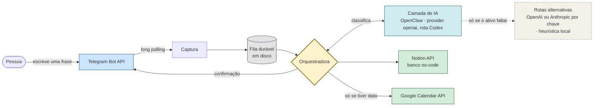
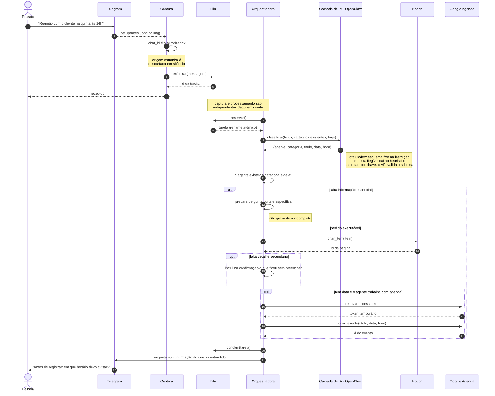
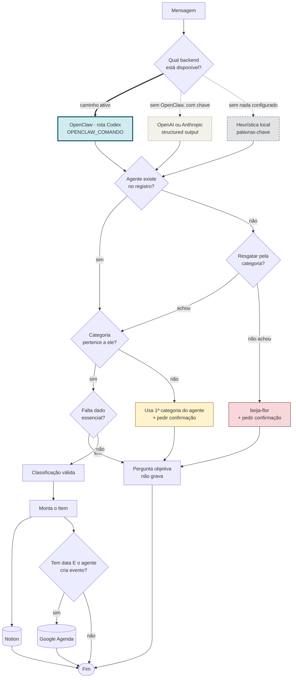
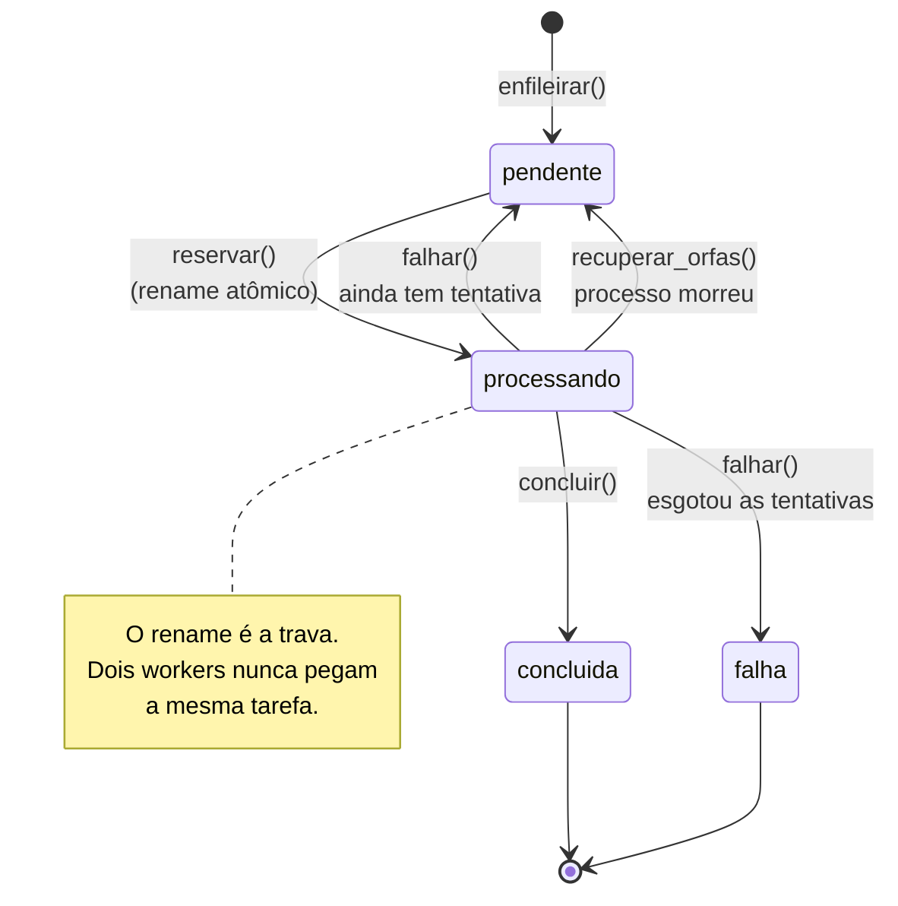
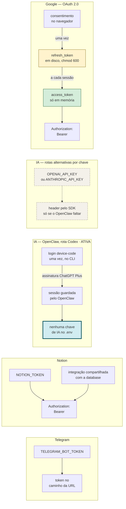
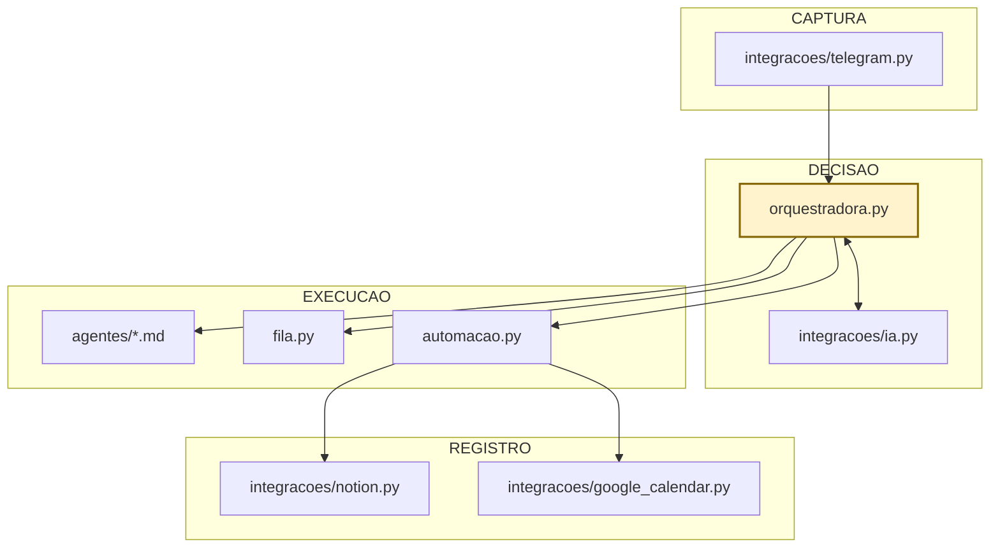
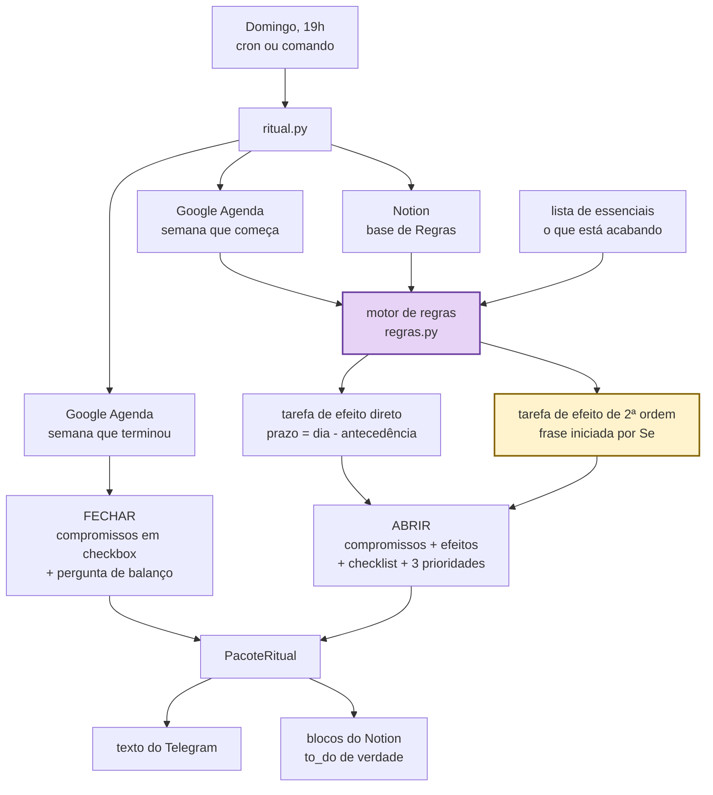

# Fluxo de integração

Diagramas do caminho que uma mensagem percorre. Renderizam direto no GitHub.

---

## 1. Visão geral das integrações

A camada de IA é uma só do ponto de vista da orquestradora. O caminho ativo é o
OpenClaw, onde a rota Codex está autenticada; as rotas por chave de API e a
heurística local existem como degradação, não como caminho principal.

---

## 2. Caminho completo de uma mensagem

---

## 3. Decisão de roteamento

A seta grossa é a única rota em uso hoje. As pontilhadas só entram em cena se a
anterior faltar — a ordem é `openclaw → openai → anthropic → heuristica`, e o
sistema nunca para por ausência de credencial, só perde precisão.

---

## 4. Estados da fila durável

---

## 5. Autenticação por API

A rota de IA em produção não tem chave para vazar: o Codex autentica por OAuth
device-code, sobre a assinatura, e a sessão fica com o CLI do OpenClaw. As
variáveis `OPENAI_API_KEY` e `ANTHROPIC_API_KEY` existem no `.env.example` para
quem preferir a rota por chave, e estão vazias na instalação em uso.

---

## 6. Camadas do código

A orquestradora é a única peça que conhece todas as outras. As integrações não
se conhecem entre si — trocar o Notion por outro banco no-code é escrever uma
classe com o método `criar_item` e passar na construção da automação.

---

## 7. Ciclo semanal: do compromisso à tarefa derivada

O fluxo acima resolve uma mensagem. Este resolve uma semana. É o mesmo sistema
olhando para um horizonte maior: em vez de perguntar "o que é isso", pergunta
"o que isso exige que aconteça antes".

O nó roxo é o único que decide alguma coisa, e mesmo ele não decide sozinho:
todo o comportamento vem das linhas da base de Regras, que é editada no Notion
por quem usa o sistema.

O nó amarelo é o efeito borboleta propriamente dito, a tarefa que só existe se
uma condição for verdadeira. Ela nasce junto com a tarefa direta e espera uma
checagem humana, porque é a única parte da corrente que o sistema não tem como
verificar sozinho.
