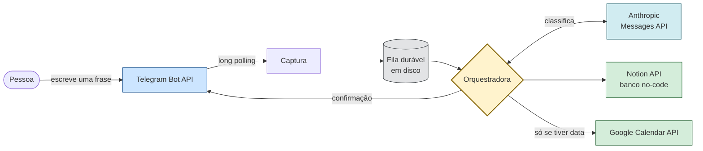
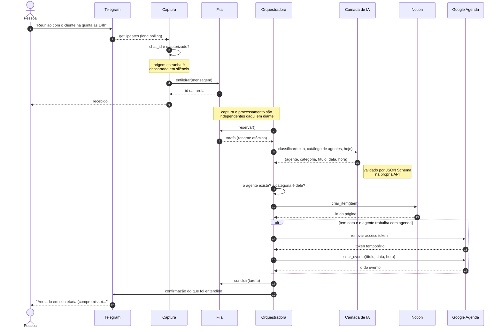
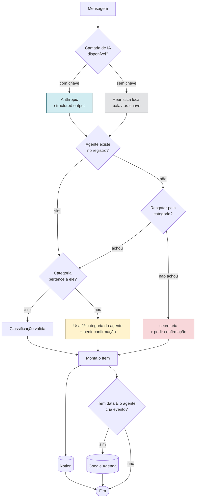
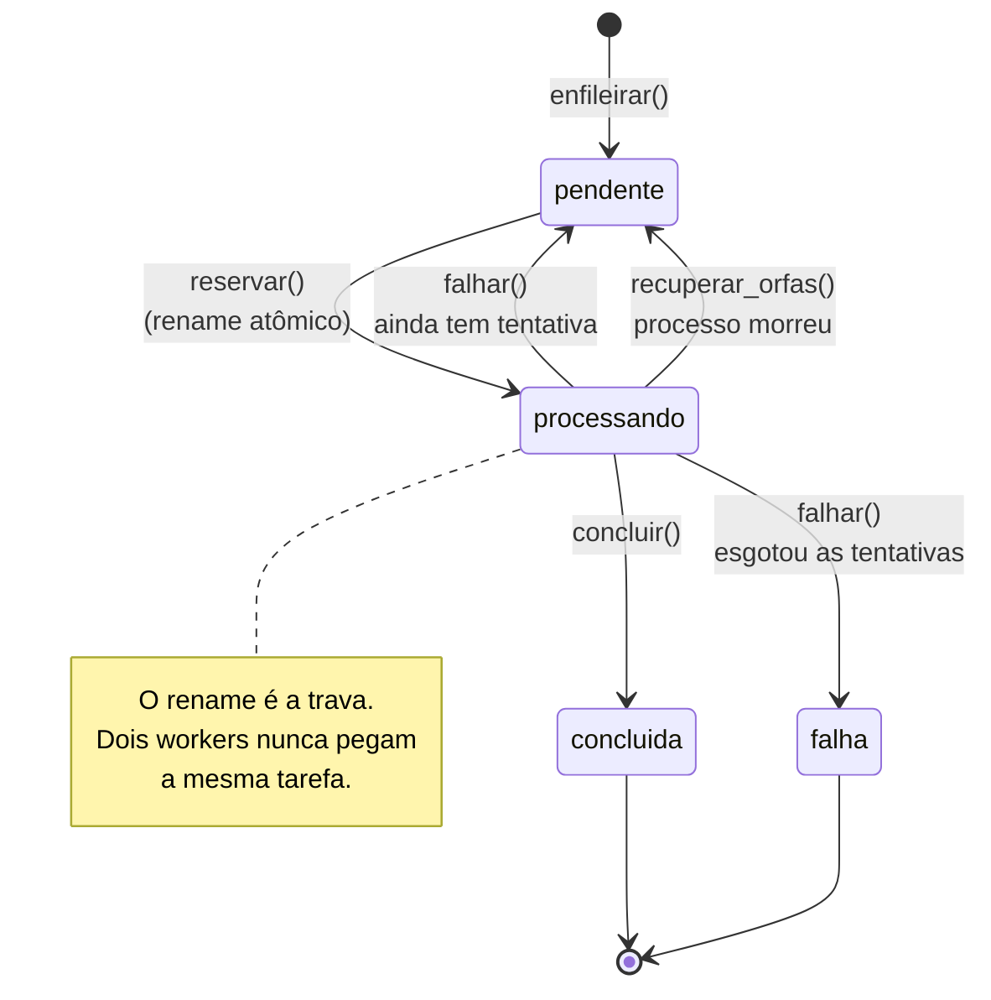
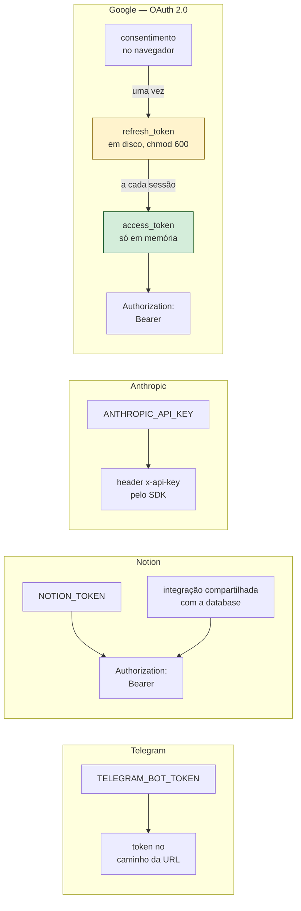
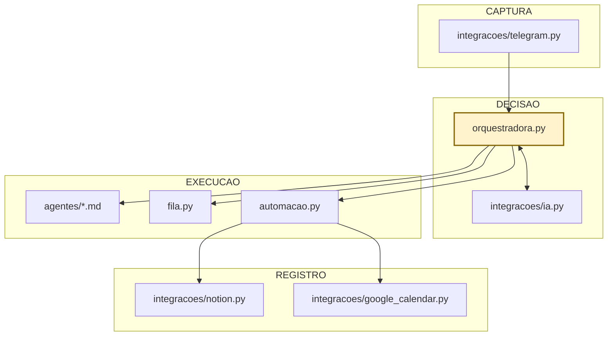

# Fluxo de integração

Diagramas do caminho que uma mensagem percorre. Renderizam direto no GitHub.

---

## 1. Visão geral das integrações

---

## 2. Caminho completo de uma mensagem

---

## 3. Decisão de roteamento

---

## 4. Estados da fila durável

---

## 5. Autenticação por API

---

## 6. Camadas do código

A orquestradora é a única peça que conhece todas as outras. As integrações não
se conhecem entre si — trocar o Notion por outro banco no-code é escrever uma
classe com o método `criar_item` e passar na construção da automação.
